# Building Hack Docs

 This is the technical [documentation](https://bcx19-buildings.github.io/documentation/) for the BCX19 [#3 Hack Challenge Buildings](https://bosch-connected-world.com/hackathon/connectedbuildings/).

> :warning: This documentation is a living document, we gladly accept `pull request` and we will of course update the document during the BCX19.

## :mega: Communication

During the hackathon we have for the buildings hack challenge our own slack channel:
<https://bcx19buildings.slack.com>

## :construction_worker: Bosch ID

To use the developer portal or connected building the precondition is to have a Bosch ID. Therefore register your [Bosch ID here](https://myaccount.bosch.com/BeaPUssWeb/registration)

## Team template

> Please provide as a team charter by EOB `13.05.`.

Download the PPT version of the template [here](assets/template_team_BCX19.pptx).

## :wrench: Setup

Please find here a high-level overview of the equipment and software stacks, which you might want to use in your hack. For each of this tools find bellow more details.

[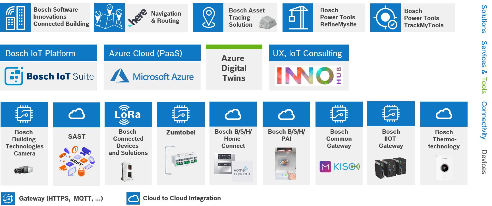](https://bcx19-buildings.github.io/documentation/assets/bcx19_cb_overview.png)

## Bosch Software Innovations Connected Building

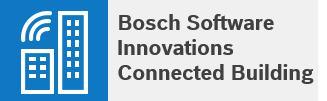

> - Which data is available?
>   - Sensor data
>   - Equipment data
>   - Building topology
> - How to access the data?
>   - REST APIs
>   - Dashboard

Connected Building is a cloud based collection of services to implement use-cases for commercial buildings. The diagram below gives a overview of the solution architecture landscape and the services.

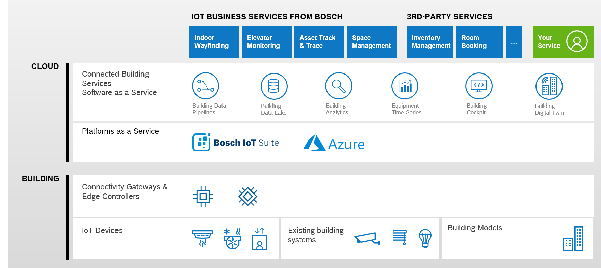

### Credentials

If you want to use the Connected Building REST API or the cockpit you require:

 - [Bosch ID](https://myaccount.bosch.com/BeaPUssWeb/registration)
 - Invitation connected building services.

For the invitation to the connected building services please send a message to slack channel: `#cb-invitation`.

### Credentials Data ingest

To send data to the connected building a `system-id` and `token` is required. Ask the connected building for your credentials.

### Connected Building Dashboard

BCX19 Dashboard: <https://eu.bosch-connectedbuilding.com/dashboard/auth/login?tenant=cb_bcx_2019>

### Connected Building APIs

The APIs are based on common REST concepts. Authentication oAuth 2.0 `Client Credentials Grant Type` and `Authorization Code Grant Type` are supported to get a access token for the API.

REST API | Description | Swagger
-- | -- | --
**External System Connector** | API to ingest data from external building systems. Data is ingested as events (create and update event body based on [Haystack](https://project-haystack.org/doc/Json) JSON) . | [docs](https://eu.bosch-connectedbuilding.com/documentation/swagger/swagger-ui.html?urls.primaryName=system-connector-app)
**Equipment State** | API to query the actual state of the equipment and the building equipment | [docs](https://eu.bosch-connectedbuilding.com/documentation/swagger/swagger-ui.html?urls.primaryName=state-app)
**Dashboard Management** | API to mange the resources for the dashboard (cockpit) e.g. heat-map or simple times series data. | [docs](https://eu.bosch-connectedbuilding.com/documentation/swagger/swagger-ui.html?urls.primaryName=dashboard-app)

### Connected Building Starters :rocket:

Please find here a list of starter to get starters with the connected building services.

Starter | Description | Link
-- | -- | --
**Equipment tracking starter** | Starter with examples how to ingest data via the REST API. Shows also how to assign a equipment to an existing space. |  <https://github.com/bcx19-buildings/equipment-tracking-starter>

## HERE Navigation & Routing

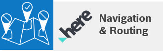

> - Which data is available?
>   - Mapped Venue with:
>     - Floor Levels
>     - Connectors
>   - Beacons for positioning
>   - Positioning API
>   - Routing API
> - How to access the data?
>   - REST APIs
>   - JS API
>   - Android SDK
>   - iOS SDK

### HERE Credentials
Get your credentials by signing up for free at: <https://developer.here.com/events/bcx19_buildings>

### HERE Documentation

Follow the documentation to include HERE maps in your application, see [HERE documentation](https://developer.here.com/documentation)

Check out our hands-on blogs to get ideas and inspiration for use cases: <https://developer.here.com/blog/topic/hands-on>

### HERE and Bosch IoT Suite

See [HERE x Bosch IoT Things](http://ec2-54-93-194-192.eu-central-1.compute.amazonaws.com/bc/x/documentation/here-x-things) documentation.

### HERE Starters :rocket:

Please find here a list of starter to get starters with HERE venues.

Starter | Description | Link
-- | -- | --
**Android SDK examples** | For Android, use the git repository, download a project and start exploring. |  <https://github.com/heremaps/here-android-sdk-examples/tree/master/3d-venues-and-indoor-routing>
**Angular Floor Plan Viewer** | Simple Angular web-app to display the `Kühlhaus` venue as a floor plan. |  <https://github.com/bcx19-buildings/here-map-angular-starter-kit>

## Bosch Asset Tracing Solution

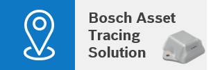

> - Which data is available?
>   - Asset Location
> - How to access the data?
>   - REST APIs

### Bosch Asset Tracing Documentation

More details see [Bosch Asset Tracing](https://www.bosch-mobility-solutions.com/en/products-and-services/mobility-services/asset-tracing-solution).

## Bosch Power Tools RefineMysite & TrackMyTools

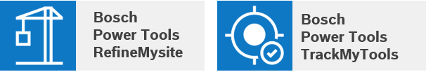

> - Which data is available?
>   - Position of power tools
>   - Field Data Connectivity
> - How to access the data?
>   - REST APIs

## Bosch IoT Suite

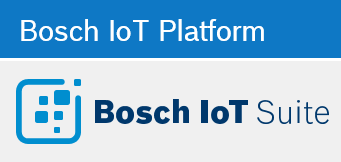

> - Which data is available?
>   - XDK
>      - Acceleration
>      - Acoustics
>      - ...
>   - SensTag 
>       - Humidity
>       - Indoor Air Quality
>       - Barometric Pressure
>       - ...
>   - Parking Sensor
>       - Occupancy
>   - ...
> - How to access the data?
>   - Bosch IoT Things
>      - REST APIs
>      - Web-Socket
>      - ...

### Bosch IoT Suite BCX Documentation

To get access to devices and find a detailed documentation for the BCX see [Bosch IoT Suite Device Portal](http://ec2-54-93-194-192.eu-central-1.compute.amazonaws.com/bc/x/devices).

## Microsoft Azure

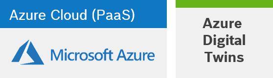

> - Which data is available?
>   - Topology Operations
>   - Sensor Changes
>   - Space Changes
>   - User-defined function notifications
>   - Device Messages: all raw telemetry from devices
> - How to access the data?
>   - Azure Event Hubs
>   - Azure Time Series Insights
>   - Azure Functions
>   - Azure Digital Twins
>   - REST APIs

**How can I get access to Azure?**
- Come to our Microsoft hack booth and get an Azure voucher with credit for this hackathon

**How can I get help with Azure / SDKs / Architecture …?**
- Come to our Microsoft hack booth, we all can code, hack, show, visualize and HELP!!!

**But, wait, I need… Machine Learning / AI / Kubernetes / the power of cloud?**
- Come to our Microsoft hack booth
- We have already prepared some additional things, like using Azure Custom Vision for analyzing coffee cups on the tables and reminding the attendees to clean up :-)

### Microsoft Azure BCX Starters :rocket:

Leverage our BCX Azure Starter-Kit!

Starter | Description | Link
-- | -- | --
**BCX Azure Starter-Kit** | Starter kit includes BCX architecture documentation, automatic provisioning, first step tutorial, two sample apps and some ideas how you can use this. |  <https://aka.ms/bcx19>

## Bosch Building Technologies InnoHub

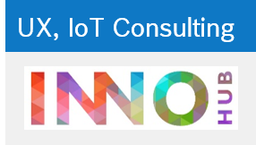

> - InnoHub provides this Services
>   - IoT Consulting
>   - UX Consulting

To use one of the cool InnoHub services add a post-it to the InnoHub planning board in `floor 4`.

## Bosch Building Technologies Cameras

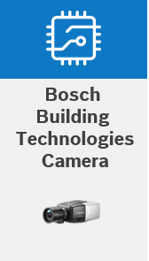

> - Which data is available?
>   - Optical sensor
>   - Events (e.g. People Count, Alarms)
> - How to access the data?
>   - Webbrowser (recommended IE with ActiveX enabled)
>   - BoschVideoSDK
>   - RTSP client (e.g. VLC player)

**How to interact with the device or the system?**

- Get Videostream (RTSP, RTP)
- Interfaces HTTP / RCPP / CGI / ONVIF
- Set up IVA tasks (ActiveX)
- Get autonomous triggered alarms / events 
- Alarm email / messages

### Bosch Securities Cameras BCX Documentation

- <https://partner.ipp.boschsecurity.com/cloud/index.php/s/r1rpGHAQdEk6QTN>
- <https://partner.ipp.boschsecurity.com/cloud/index.php/s/m1fI4g9k0xwBr46>

## SAST

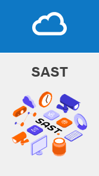

> - Which data is available?
>   - 4k / UHD images @ 30 fps
>   - Example app with TensorFlow and OpenCV integration
>   - Person’s pose data ready to use
>   - Extend app to generate the data you need
> - How to access the data?
>   - REST APIs
>   - RTSP Stream
>   - Push data to cloud using REST APIs (e.g., Bosch IoT Suite)

**How to interact with the device or the system?**

- Write your own App using Android Studio and SAST APIs to process images and - generate the desired data
- Interface App’s custom REST APIs 
- Connect App to the cloud

> **Hint:** Ideally, form a team of persons knowing
> - Android app development 
> - Computer Vision (e.g., OpenCV, TensorFlow)
> 
> Note: Android Studio needs to be installed on your laptop

### SAST Documentation

More information: https://developer.live.sastiot.com

## Bosch Connected Devices and Solutions

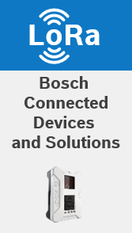

> - Which data is available?
>   - XDK
>      - Acceleration
>      - Acoustics
>      - ...
>   - SensTag 
>       - Humidity
>       - Indoor Air Quality
>       - Barometric Pressure
>       - ...
>   - ...
> - How to access the data?
>   - XDK firmware
>   - Bosch IoT Suite
>   - Connected Building
>   - Azure Event Hub
>   - ...

### Documentation XDK Usage BCX

To get access to devices and find a detailed documentation for the BCX see [Bosch IoT Suite Device Portal](http://ec2-54-93-194-192.eu-central-1.compute.amazonaws.com/bc/x/devices).

## Zumtobel Lighting and Controls

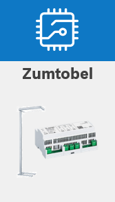

> - Which data is available?
>   - Desk occupancy
>   - Air Quality: Temperature, VOC, CO2, Humidity, Noise
> - How to access the data?
>   - Connected Building
>   - Azure Event Hub
>   - REST APIs

### Documentation Zumtobel

For the REST API documentation see <https://cb-zumtobel-lms-command-app.azurewebsites.net/documentation/swagger/swagger-ui.html>

## Bosch B/S/H/ Home Connect

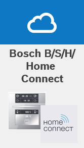

> - Which data is available?
>   - Sensor data from: Oven,
>   - coffee machine,
>   - fridge,
>   - dishwasher, and ...
> - How to access the data?
>   - Home connect

### Documentation BCX

To get started, please create a developer account [here](https://developer.home-connect.com)

## Bosch B/S/H/ PAI

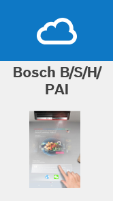

PAI Projected interactive assistance for the smart kitchen

## Bosch Common Gateway

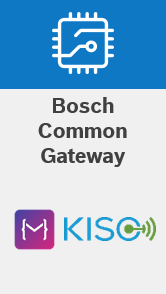

> - Which data is available?
>   - Accelerometer
>   - Environmental: Humidity, Pressure, Temperature
> - How to access the data?
>   - C API: Eclipse Kiso
>   - High Level language: Eclipse Mita
>   - Mobile Network Connection
>   - Bosch IoT Cloud

### Documentation Bosch Common Gateway BCX

Documentation Eclipse Mita: <https://www.eclipse.org/mita/>

## Bosch IIOT Gateway

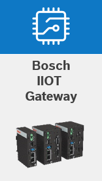

Bosch IIOT Gateway with a OSGi based gateway software. Add your own logic in the fog layer as OSGi bundle.

## Bosch Thermo-technology EasyControl

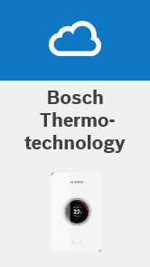

> - Which data is available?
>   - Room temperature
>   - Room target temperature
>   - User mode
> - How to access the data?
>   - Bosch Developer Portal
>   - Bosch Thermotechnology API

### Documentation EasyControl BCX

- EasyControl of Bosch - <https://www.bosch-easycontrol.com>
- Bosch Thermotechnology API -  <https://developer.bosch.com>
- Join our community - <https://community.developer.bosch.com>

### EasyControl Starters :rocket:

Starter | Description | Link
-- | -- | --
**EasyControl Starter Kit** | One pager with all infos and links e.g. Postman collection |  <http://bit.ly/2Ynl867>

